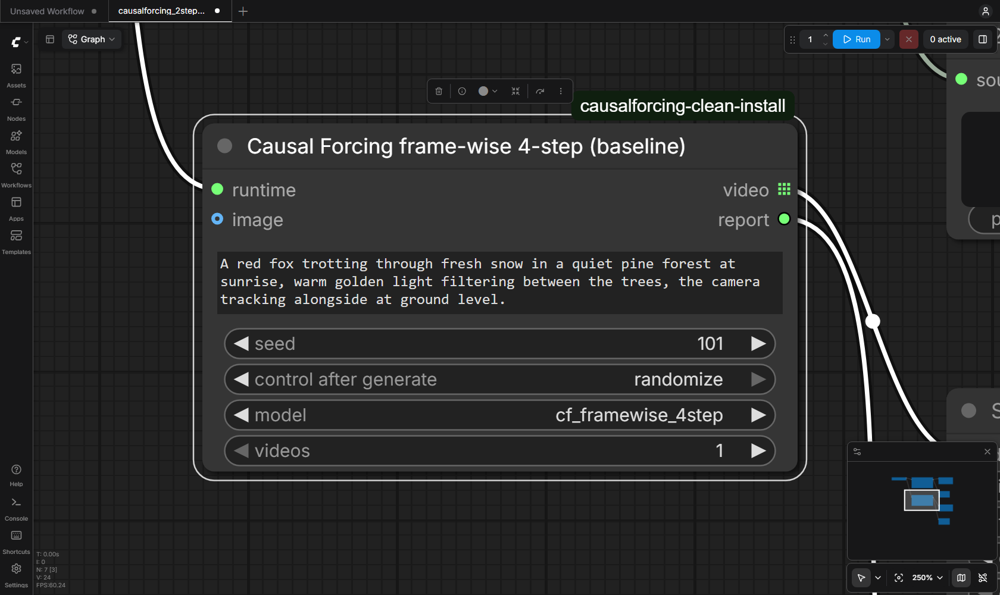

# ComfyUI-CausalForcing

Unofficial ComfyUI integration of [Causal Forcing](https://arxiv.org/abs/2602.02214)
and [Causal Forcing++](https://arxiv.org/abs/2605.15141)
([code](https://github.com/thu-ml/Causal-Forcing),
[models](https://huggingface.co/zhuhz22/Causal-Forcing),
[project page](https://thu-ml.github.io/CausalForcing.github.io)). Not
affiliated with or endorsed by the Causal Forcing authors, Tsinghua
University, Shengshu, Alibaba (Wan) or Comfy Org.

日本語の概要: [README.ja.md](README.ja.md)

Causal Forcing distils Wan2.1-T2V-1.3B into an autoregressive video model that
generates one latent frame (frame-wise) or one chunk of frames (chunk-wise) at
a time with a few denoising steps; Causal Forcing++ released the first
frame-wise 2-step and 1-step models. This package runs the **official
checkpoints with the official inference pipeline** from ComfyUI:

- **Causal Forcing Runtime**: pick a runtime the administrator registered (a
  WSL2 or Linux venv with the pinned upstream checkout and the weights).
  Workflows cannot name executables or commands.
- **Causal Forcing Generate (T2V / I2V)**: 832x480, 81 frames at 16 fps, 1-4
  videos per job. Models: `cfpp_framewise_2step` (Causal Forcing++ frame-wise
  2-step, default) and `cf_framewise_4step` (Causal Forcing frame-wise 4-step,
  the baseline). Optional `image` input for frame-wise image-to-video. Returns
  real ComfyUI `VIDEO` outputs and a JSON report with the generator forwards
  actually run, per-phase timings, memory and the checkpoint load evidence.
- **Causal Forcing Doctor**: checks the runtime (upstream files against the
  pinned commit, model and checkpoint files, CUDA and flash-attn).


*Left: Causal Forcing++ frame-wise 2-step; right: Causal Forcing frame-wise
4-step; same prompt, seed and initial noise (different trained checkpoints, so
the videos differ). Reduced preview; full-resolution MP4s are in the
[v0.1.0 release](https://github.com/hiroki-abe-58/ComfyUI-CausalForcing/releases/tag/v0.1.0).*

## Results (RTX 5090, WSL2, 832x480, 81 frames)

Warm runs, mean of 6 videos (3 prompts x 2 seeds) per model; details, cold
start and raw records in [docs/BENCHMARKS.md](docs/BENCHMARKS.md).

| Model | Generator forwards per video | Generator | Inference total (text encode + generator + VAE) | Whole GPU peak |
| --- | --- | --- | --- | --- |
| `cfpp_framewise_2step` | 65 (2 steps per frame, 4 for the first frame, + 21 context updates) | 7.05 s | 12.31 s | 20.3 GB |
| `cf_framewise_4step` | 105 (4 steps per frame + 21 context updates) | 10.97 s | 16.29 s | 20.3 GB |

- **Same output as the official script**: for the same prompt and seed, the
  official `inference.py` and this package produce identical initial noise,
  identical latents and identical 8-bit frames for both models
  ([check](docs/results/reference_check.json)).
- The 2-step model's generator was 1.56x faster than the 4-step model's here;
  end to end 1.32x. MP4 playback is 16 fps; these are not real-time or paper
  latency figures (other GPU, other measurement).
- Quality: by eye, both models gave coherent videos for all 6 prompt/seed
  pairs; the 4-step model moves the camera and subjects much more, the 2-step
  model keeps steadier shots. Six pairs are not a quality benchmark.

## Status

| | Scope |
| --- | --- |
| **Tested** (real weights) | ComfyUI v0.38.0 on Windows 11 with a WSL2 Ubuntu 24.04 runtime (torch 2.8.0+cu128, flash-attn 2.8.3), RTX 5090 32 GB. Text-to-video with both models (frame-wise 2-step and 4-step), 832x480x81, batch 1, bit-identical to the official script. Through ComfyUI's HTTP API: generation with `Save Video`, image-to-video with the 2-step model, Doctor, cancel, timeout and runtime errors (no process left behind, GPU memory back to idle). Clean install from `git archive`. |
| **Tested** (CPU CI) | Ubuntu and Windows: config and job validation, argv/environment construction, the enforced forward counts, real subprocess control with a fake runtime (cancel/timeout stop the whole process tree on Linux), node registration and `validate_prompt` in a real ComfyUI checkout, `VIDEO` outputs, the image input. |
| **Not verified yet** | `cfpp_framewise_1step` and `cf_chunkwise_4step` are accepted by the runner (official configs and checkpoints) but were **not run** for this release; the Doctor and the runner check their schedules, but there is no real-weight result. Image-to-video with the 4-step model. |
| **Untested** | Linux ComfyUI hosts with real weights, other GPUs, GPUs below 32 GB, other resolutions or lengths. |
| **Not supported** | Long video / Rolling Forcing, the HY1.5 8B models, training, native Windows runtimes. A persistent worker (as in ComfyUI-MonarchRT 0.2.0) is not part of this release: every job starts a runtime process (model load about 35-42 s plus the first prompt encoding on this machine). |

## Install

1. Install the node: clone this repository into `ComfyUI/custom_nodes/` (no
   Python dependencies are added to ComfyUI).
2. Set up a runtime and download the weights: [docs/SETUP.md](docs/SETUP.md).
3. Register the runtime in `ComfyUI/user/causalforcing.runtimes.json`
   (template: [examples/causalforcing.runtimes.example.json](examples/causalforcing.runtimes.example.json)),
   restart ComfyUI and run **Causal Forcing Doctor**.
4. Load [workflows/causalforcing_2step_vs_4step.json](workflows/causalforcing_2step_vs_4step.json)
   (or `causalforcing_i2v_2step.json`), select your runtime and queue it.



## How it works

ComfyUI writes a schema-checked job file into a fresh job folder and starts
`runtime/cf_job.py` with the runtime's Python (`wsl.exe -d <distro> --exec
...` on Windows). The runner imports the pinned upstream code unmodified and
follows the official `inference.py` for each video:

- the official config of the model; the checkpoint key the official command
  uses (`generator_ema` with `--use_ema`); FSDP prefixes mapped explicitly and
  every generator tensor loaded with `strict=True` (upstream falls back to
  `strict=False`; this package refuses a partial load);
- `set_seed(seed)` right before the noise, as the official script;
- the official step lists including the 4-step first frame of the 1/2-step
  models, timestep warping, re-noising, the clean-context KV update per frame
  and the KV-cache reset per video, all inside the unmodified upstream
  pipeline; the runner counts the generator calls and fails on a mismatch;
- for image-to-video, the official transform (resize to 832x480, normalise)
  and VAE encoding of the first frame;
- every `torch.load` with `weights_only=True`.

Details: [docs/SECURITY.md](docs/SECURITY.md), [docs/TESTING.md](docs/TESTING.md),
[docs/BENCHMARKS.md](docs/BENCHMARKS.md), [docs/LICENSING.md](docs/LICENSING.md).

This package is separate from
[ComfyUI-MonarchRT](https://github.com/hiroki-abe-58/ComfyUI-MonarchRT) (same
author): Causal Forcing and MonarchRT are different methods, and each package
runs its own upstream in its own runtime.

## Registry

Comfy Registry node id `causalforcing` (publisher `hiroki-abe-58`); see the
release notes for the current state.

## License

Apache License 2.0 for this repository. Upstream code and weights are
installed separately under their own licenses; see
[docs/LICENSING.md](docs/LICENSING.md).

## Citation

If you use Causal Forcing, cite the papers:

```bibtex
@article{zhu2026causal,
  title={Causal Forcing: Autoregressive Diffusion Distillation Done Right for High-Quality Real-Time Interactive Video Generation},
  author={Zhu, Hongzhou and Zhao, Min and He, Guande and Su, Hang and Li, Chongxuan and Zhu, Jun},
  journal={arXiv preprint arXiv:2602.02214},
  year={2026}
}

@article{zhao2026causal,
  title={Causal Forcing++: Scalable Few-Step Autoregressive Diffusion Distillation for Real-Time Interactive Video Generation},
  author={Zhao, Min and Zhu, Hongzhou and Zheng, Kaiwen and Zhou, Zihan and Yan, Bokai and Li, Xinyuan and Yang, Xiao and Li, Chongxuan and Zhu, Jun},
  journal={arXiv preprint arXiv:2605.15141},
  year={2026}
}
```
