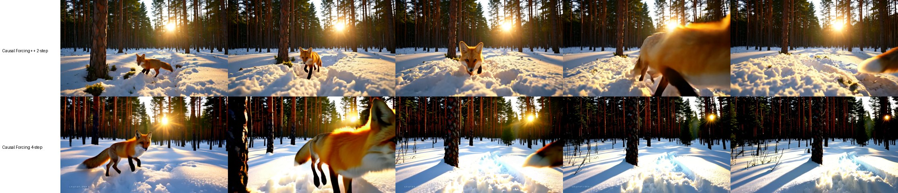
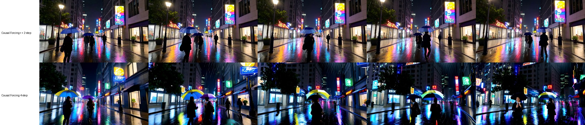

# Benchmarks and comparison

Everything below is from one machine, one night (2026-10-02/03), with the setup
in `docs/SETUP.md`. Raw records: `docs/results/benchmark_runs.json` (every
video: timings, forward counts, memory, hashes), `docs/results/b_summary.json`
(analysis), `docs/results/reference_check.json` (official script vs this
package), `docs/results/gpu_e2e_report.json` (ComfyUI HTTP end-to-end). The
MP4 files are Release assets.

## Setup

| | |
| --- | --- |
| GPU | NVIDIA GeForce RTX 5090 32 GB, driver 595.95, shared with the Windows desktop (about 2.2 GB in use at idle) |
| Runtime | WSL2 Ubuntu 24.04 (31 GB memory limit), Python 3.10.22, torch 2.8.0+cu128, flash-attn 2.8.3 |
| Upstream | thu-ml/Causal-Forcing `da3ddf1`, unmodified |
| Checkpoints | zhuhz22/Causal-Forcing `2f8eb8b`: `causal-forcing++/framewise-2step.pt` (sha256 `8f899a01...`), `framewise/causal_forcing.pt` (sha256 `70cae8c3...`), both `generator_ema` as in the official commands; Wan2.1-T2V-1.3B `37ec512` (text encoder, VAE, model config) |
| Video | 832x480, 21 latent frames -> 81 RGB frames, batch 1, frame-wise (one latent frame per block) |
| Offload | `offload_text_encoder: true` (what upstream `inference.py` does below 40 GB free VRAM) |
| Models on disk | NTFS drive mounted in WSL2 (`/mnt/...`): slow model loading and first text encoding |

Prompts (written for this test, used verbatim, no prompt extension):

1. A red fox trotting through fresh snow in a quiet pine forest at sunrise, warm golden light filtering between the trees, the camera tracking alongside at ground level.
2. Ocean waves crashing against dark volcanic rocks on a stormy coastline, white spray bursting into the air, overcast sky, cinematic wide shot.
3. A rainy city street at night lit by neon signs, people with umbrellas walking past glowing shop windows, colorful reflections shimmering on the wet pavement.

Seeds 101 and 2026 -> 6 videos per model, in one process per model after a
warm-up video (prompt 1, seed 101). Seeding follows the official script
(`set_seed(seed)` right before the noise is drawn).

## Same output as the official script

The official `inference.py` was run unchanged for prompt 1, seed 101 with each
checkpoint (`--use_ema --seed 101`), with three guards that do not change the
computation: `weights_only=True` loading, the bf16 meta-device build of the T5
encoder (bit-identical weights, needed to fit WSL2's memory), and capturing
the initial noise, the returned latents and the float frames it passes to
`write_video`. This package's runtime, run separately for the same prompt and
seed, produced:

| | initial noise | 21 latent frames | 81 RGB frames (uint8, before H.264) | generator forwards |
| --- | --- | --- | --- | --- |
| 2-step vs official | identical | identical | identical | 65 = 65 |
| 4-step vs official | identical | identical | identical | 105 = 105 |

The MP4 bytes differ only because the official script encodes with
`torchvision.io.write_video` and this package with its own H.264 settings
(CRF 18).

## Generator forwards (counted per video)

| Model | per frame | first frame | context updates | total |
| --- | --- | --- | --- | --- |
| Causal Forcing++ frame-wise 2-step | 2 | 4 (official first-frame schedule) | 21 | 44 + 21 = 65 |
| Causal Forcing frame-wise 4-step | 4 | 4 | 21 | 84 + 21 = 105 |

Image-to-video adds one context pass for the input frame and generates 20
frames (2-step: 42 + 21 = 63). The runner fails a job if the counts differ
from the model's schedule.

## Speed (warm, per 81-frame video, mean of 6, [min-max])

| | 2-step | 4-step |
| --- | --- | --- |
| Generator forwards | 7.05 s [6.57-7.64] | 10.97 s [10.44-11.89] |
| of which denoising steps | 4.81 s | 8.72 s |
| of which context updates | 2.24 s | 2.25 s |
| first frame (4 steps, both models) | 0.42 s | 0.41 s |
| VAE decode | 3.28 s | 3.25 s |
| Text encode (offloaded T5) | 1.74 s | 1.62 s |
| Inference total (text encode + generator + VAE) | 12.31 s [11.47-13.31] | 16.29 s [15.45-18.05] |
| Generator frames/s (81 / generator) | 11.5 | 7.4 |

- The 2-step model's generator is 1.56x faster than the 4-step model's on
  this machine (denoising steps alone: 1.81x); end to end 1.32x.
- First video of a process: model loading 35-42 s (NTFS mount) and the first
  prompt encoding about 58-59 s (reading the 11 GB T5 file); no autotuning.
- MP4 playback is 16 fps; "frames/s" here is the throughput of the generator
  only, not real-time generation end to end, and is not comparable with the
  latency/FPS figures in the papers (other GPU, other measurement).

Upstream's `--report_timing` measures text encoding plus diffusion (VAE
excluded) and the denoising of the first block; this package reports the
phases separately instead (see the raw records).

## Memory

| | 2-step | 4-step |
| --- | --- | --- |
| torch max allocated | 12.7 GiB | 12.7 GiB |
| torch max reserved | 17.1 GiB | 17.1 GiB |
| whole GPU (nvidia-smi, includes the desktop) | 20.3 GB | 20.3 GB |
| WSL2 process peak RSS | 13.8 GiB | 13.8 GiB |

Observed peaks for this configuration, not minimum requirements.

## Output comparison

The two models are different trained checkpoints, so the same seed and noise
give different videos (no pixel match is expected). Frame review of all 12
videos (frames 0, 20, 40, 60, 80, see below; full videos in the release):

- Both models gave coherent, prompt-following videos for all 6 prompt/seed
  pairs, with no collapsed or noisy frames.
- The 4-step model shows much stronger camera and subject motion (mean
  absolute frame-to-frame change 18.3 vs 8.0 for the 2-step model); the 2-step
  videos keep a steadier composition.
- One 4-step video (prompt 1, seed 101) shows a small watermark-like text
  artifact in the bottom-left corner.

Six prompt/seed pairs reviewed by eye are not a quality benchmark; this
documents what was observed, not that one model is better in general.

## Image-to-video (2-step, through ComfyUI)

One run through ComfyUI's HTTP API (`LoadImage` -> **Causal Forcing
Generate**, see `workflows/causalforcing_i2v_2step.json`): input image = frame 0
of the 2-step video for prompt 2, seed 101; prompt "The scene comes alive:
gentle wind, drifting clouds, slow camera push-in."; seed 21.

- 42 denoising forwards + 21 context updates = 63 (20 generated latent frames
  after the encoded input frame), as expected from the schedule.
- Generator 6.40 s, VAE encode of the image 0.26 s, VAE decode 3.27 s (the
  first text encoding of the process took 59.7 s, see "Speed").
- 81 frames decoded from the saved MP4; the video continues the input frame
  (same coastline and sky, moving surf).

One input and one seed; the 4-step model's image-to-video path was not run.
